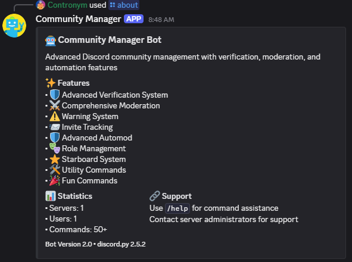
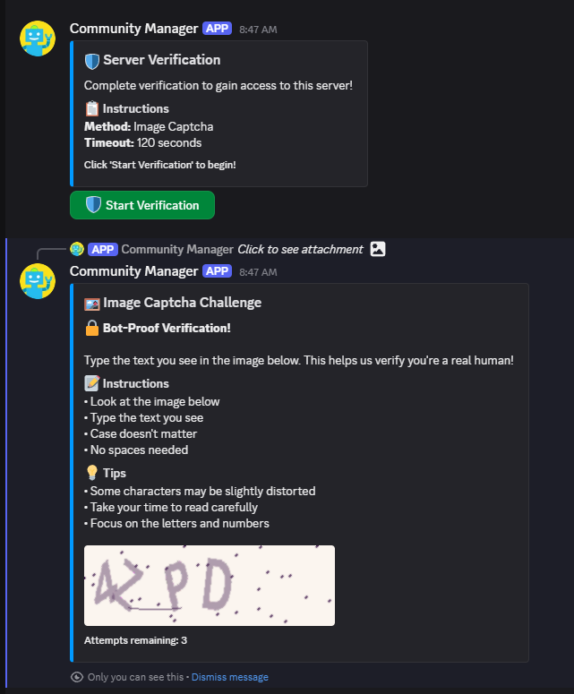
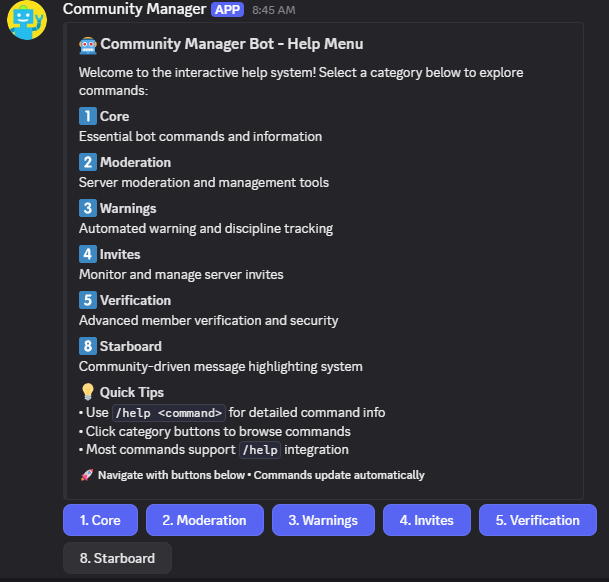
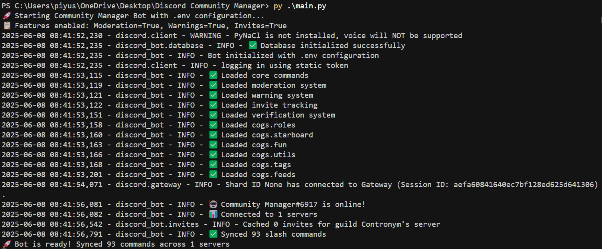

# 🤖 Community Manager Bot

A comprehensive Discord bot for advanced community management with verification systems, moderation tools, and automation features. Built with Python and discord.py.



## ✨ Features

### 🛡️ Advanced Verification System
- **Multi-Method Verification**: Simple button, math captcha, text captcha, emoji sequences, and image verification
- **Customizable UI**: Form-based or dropdown-based interfaces for maximum compatibility
- **Anti-Bot Protection**: Advanced captcha systems to prevent automated account creation
- **Mobile-Friendly**: Responsive interfaces that work on all devices



### ⚔️ Comprehensive Moderation
- **Member Management**: Kick, ban, timeout with customizable durations
- **Channel Control**: Lock channels, set slowmode, bulk message deletion
- **Warning System**: Track member warnings with automatic action thresholds
- **Permission Hierarchy**: Owner > Admin > Moderator role-based permissions

### 🎮 Community Features
- **Role Management**: Automated role assignment and reaction roles
- **Starboard System**: Community-driven message highlighting
- **Tag System**: Custom server commands and responses
- **RSS Feeds**: Automated content updates from external sources
- **Utility Commands**: Server info, user lookup, invite tracking



## 🚀 Quick Start

### Prerequisites
- Python 3.8 or higher
- Discord Bot Token ([Get one here](https://discord.com/developers/applications))

### Installation

#### Windows (Easy Method)
1. **Download** the project and extract it
2. **Run** `start.bat` - It will install everything automatically!

#### Linux/Mac (Easy Method)
1. **Download** the project and extract it
2. **Run** `chmod +x start.sh && ./start.sh`

#### Manual Installation
```bash
# Clone the repository
git clone https://github.com/404Piyush/discord-community-manager.git
cd discord-community-manager

# Install dependencies
pip install -r requirements.txt

# Configure the bot
cp config.env.example config.env
# Edit config.env with your bot token

# Run the bot
python main.py
```



## ⚙️ Configuration

Create a `config.env` file in the root directory:

```env
# Required: Your Discord Bot Token
DISCORD_TOKEN=your_bot_token_here

# Optional: Feature toggles (true/false)
ENABLE_VERIFICATION=true
ENABLE_MODERATION=true
ENABLE_WARNINGS=true
ENABLE_INVITES=true
ENABLE_AUTOMOD=true
ENABLE_STARBOARD=true
ENABLE_TAGS=true
ENABLE_FEEDS=true

# Optional: Bot behavior
COMMAND_PREFIX=!
LOG_LEVEL=INFO
```

## 🛠️ Available Commands

### Core Commands
- `/help` - Interactive help system with button navigation
- `/about` - Bot information and statistics
- `/userinfo` - Detailed user information
- `/serverinfo` - Server statistics and settings
- `/ping` - Bot latency check

### Verification System
- `/setup-verification` - Interactive verification setup wizard
- `/test-verification` - Test the verification system
- `/verification-info` - View current verification configuration
- `/manual-verify` - Manually verify a user
- `/verification-stats` - View verification statistics

### Moderation Tools
- `/kick` - Remove member from server
- `/ban` - Permanently ban member
- `/timeout` - Temporarily restrict member
- `/clear` - Bulk delete messages
- `/lock` - Lock channel to prevent new messages
- `/slowmode` - Set channel slowmode

### Warning System
- `/warn` - Issue warning to member
- `/checkwarns` - View member's warnings
- `/clearwarns` - Clear member's warnings

## 🔧 Features Overview

### Verification Types
1. **Simple Button** - One-click verification (basic security)
2. **Math Captcha** - Solve arithmetic problems (medium security)
3. **Text Captcha** - Type exact text shown (high security)
4. **Image Captcha** - Advanced visual verification (maximum security)
5. **Emoji Sequence** - Remember and click emoji patterns
6. **Color Buttons** - Click the correct color
7. **Word Scramble** - Unscramble words

### Permission System
- **Owner**: Full bot control and configuration
- **Admin**: Advanced moderation and system management
- **Moderator**: Basic moderation tools
- **Everyone**: Standard member commands

### Database Features
- **SQLite Database**: Lightweight, no external dependencies
- **Automatic Backups**: Built-in data protection
- **Migration Support**: Seamless updates
- **Performance Optimized**: Efficient queries and caching

## 📱 Mobile Support

The bot is fully optimized for mobile Discord clients:
- Responsive button layouts
- Touch-friendly interfaces
- Dropdown menus for easy selection
- Clear visual feedback

## 🛡️ Security Features

- **Rate Limiting**: Prevents spam and abuse
- **Permission Validation**: Role-based access control
- **Input Sanitization**: Prevents injection attacks
- **Audit Logging**: Track all moderation actions
- **Anti-Bot Protection**: Advanced captcha systems

## 🔄 Updates and Maintenance

The bot automatically handles:
- Database migrations
- Configuration updates
- Feature toggles
- Error recovery
- Performance monitoring

## 📋 System Requirements

**Minimum:**
- Python 3.8+
- 512MB RAM
- 100MB disk space
- Internet connection

**Recommended:**
- Python 3.11+
- 1GB RAM
- 500MB disk space
- Stable internet connection

## 🆘 Support

If you encounter any issues:

1. **Check Logs**: Look at the console output for error messages
2. **Verify Configuration**: Ensure your `config.env` file is correct
3. **Bot Permissions**: Make sure the bot has necessary Discord permissions
4. **Dependencies**: Run `pip install -r requirements.txt` to update packages

## 📄 License

This project is licensed under the MIT License - see the LICENSE file for details.

## 🚀 Deployment

### Self-Hosting
1. Follow the installation guide above
2. Keep the bot running 24/7 using a process manager like PM2 or systemd
3. Regular backups of the `data/` directory are recommended

### Cloud Hosting
The bot is compatible with:
- Heroku
- Railway
- DigitalOcean
- AWS EC2
- Google Cloud Platform

---

**Made with ❤️ for Discord communities** 